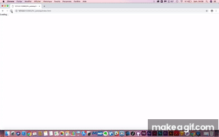

# projet_patatap_1819
This repo holds the code for a creative coding class with [p5js](https://p5js.org/) taught [@lecolededesign](https://www.lecolededesign.com/) : students were asked to create a webpage holding 26 sounds and 26 animation - on for each letter of the alphabet. Using as an inspiration : [patatap](https://www.patatap.com/)

## Simon Heurtebise

L’objectif de mon patatap est de permettre à l’utilisateur de générer sa propre instrumentale de trap sans forcément avoir des compétences musicales. Le trap est un courant musical issu du Dirty South, ayant émergé au début des années 1990 dans le sud des États-Unis. Dans cette production, nous pouvons constater de nombreux sons faisant référence au trap (kicks, basse, snares, hats...)

[Cliquez ici pour jouer](https://ateliernum.github.io/projet_patatap_1819/Heurtebise_Simon/index.html)

## Théo Geiller 

L'idée du Virus/Maladie/Angoisse, avec les moments de faiblesse et de souffrance et les moment plus apaisant de relâchement.

C'est une représentation abstraite, un terrain de jeux pour diverses expérimentations autour de la sonorité des couleurs, formes, déplacements et transformations.

La dernière ligne propose des perceptions d'objets solides qui s'avèrent être flexible, rapport interessant de la prise de lumière d'un objet.

[Cliquez ici pour jouer](https://ateliernum.github.io/projet_patatap_1819/Geiller_Th2o/index.html)

## Julie Thierry  

J’ai décidé d’orienter mon patatap sur les couleurs. Je voulais me rapprocher d’un effet d’hallucination, d’illusion avec des couleurs très contrastées et saturées et des animations parfois chargées. J’ai choisi des sons simples, essentiellement des percussions et des cordes, avec souvent d’une seule note pour contraster avec les animations très colorées, et, ou, prenant tout l’écran, pour pouvoir garder une certaine harmonie.  

[Cliquez ici pour jouer](https://ateliernum.github.io/projet_patatap_1819/Thierry_Julie/index.html)

## Emilie Schaeffer  

Mon patatap s'inspire de l'univers graphique et sonore du groupe français Polo & Pan, dont le style musical est parfois appelé "mutinerie électronique", puisque leurs morceaux sortent dessentiers battus. J'adore ce groupe car son univers est vraiment singulier et gai (instrus rhytmées et légères, paroles totalement décallées et étranges, couleurs joyeuses...).

C'est pourquoi j'ai choisi ce thème comme fil rouge, sans proposer de scénario en particulier, (aussi décousu que les morceaux de Polo&Pan) mais en favorisant la découverte aléatoire de mon patatap.

[Cliquez ici pour jouer](https://ateliernum.github.io/projet_patatap_1819/Schaeffer_Emilie/index.html)

## Raphael Perraud  

Sound ambiance of a record session, w/ some licks and sounds mostly jazz & blues, this project try to give a visual representation to each of them, and transmit the agitation of this moments. Almost cacophonous, but suffused with the energy of the musicians, the ambient disorder of this project represents this sessions of sound creation in full boiling.

[Cliquez ici pour jouer](https://ateliernum.github.io/projet_patatap_1819/Perraud_Raphael/index.html)

## Arslan Sifaoui  

Pour mon patatap je voulais un ambiance visuellement douce à l'image des svg morph du Patatap d'origine. C'est pour cela que j'ai associé couleur pastel et formes arrondis. Je voulais également que les sons illustrent les animations et vice versa. 
Et qu'elles puissent toutes jouer ensembles sans se gêner aussi bien avec le sons que visuellement. 
L'ambiance sonore est varié, elle mélange sons "neutres" et "percusifs" comme des kicks, woosh, snap ... et petites mélodie instrumentales et permet donc la tentative de créations de mélodies. 

[Cliquez ici pour jouer](https://ateliernum.github.io/projet_patatap_1819/Sifaoui_Arslan/index.html)

## Elliot Chevalier

[Cliquez ici pour jouer](https://ateliernum.github.io/projet_patatap_1819/Chevalier_Elliot/index.html)

