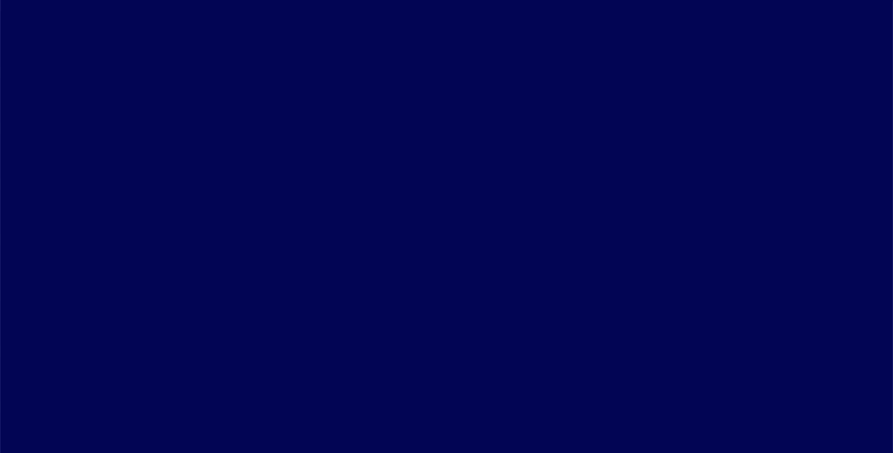
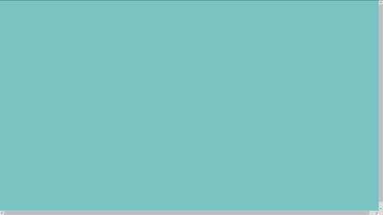

# projet_patatap_1819

This repo holds the code for a creative coding class with [p5js](https://p5js.org/) taught [@lecolededesign](https://www.lecolededesign.com/) : students were asked to create a webpage holding 26 sounds and 26 animation - on for each letter of the alphabet. Using as an inspiration : [patatap](https://www.patatap.com/).

Code is available [here](https://github.com/AtelierNum/projet_patatap_1819)

## Simon Heurtebise

L’objectif de mon patatap est de permettre à l’utilisateur de générer sa propre instrumentale de trap sans forcément avoir des compétences musicales. Le trap est un courant musical issu du Dirty South, ayant émergé au début des années 1990 dans le sud des États-Unis. Dans cette production, nous pouvons constater de nombreux sons faisant référence au trap (kicks, basse, snares, hats...)

[Cliquez ici pour jouer](https://ateliernum.github.io/projet_patatap_1819/Heurtebise_Simon/index.html)

## Théo Geiller 

L'idée du Virus/Maladie/Angoisse, avec les moments de faiblesse et de souffrance et les moment plus apaisant de relâchement.

C'est une représentation abstraite, un terrain de jeux pour diverses expérimentations autour de la sonorité des couleurs, formes, déplacements et transformations.

La dernière ligne propose des perceptions d'objets solides qui s'avèrent être flexible, rapport interessant de la prise de lumière d'un objet.

[Cliquez ici pour jouer](https://ateliernum.github.io/projet_patatap_1819/Geiller_Th2o/index.html)

## Julie Thierry  

J’ai décidé d’orienter mon patatap sur les couleurs. Je voulais me rapprocher d’un effet d’hallucination, d’illusion avec des couleurs très contrastées et saturées et des animations parfois chargées. J’ai choisi des sons simples, essentiellement des percussions et des cordes, avec souvent d’une seule note pour contraster avec les animations très colorées, et, ou, prenant tout l’écran, pour pouvoir garder une certaine harmonie.  

[Cliquez ici pour jouer](https://ateliernum.github.io/projet_patatap_1819/Thierry_Julie/index.html)

## Emilie Schaeffer  

Mon patatap s'inspire de l'univers graphique et sonore du groupe français Polo & Pan, dont le style musical est parfois appelé "mutinerie électronique", puisque leurs morceaux sortent dessentiers battus. J'adore ce groupe car son univers est vraiment singulier et gai (instrus rhytmées et légères, paroles totalement décallées et étranges, couleurs joyeuses...).

C'est pourquoi j'ai choisi ce thème comme fil rouge, sans proposer de scénario en particulier, (aussi décousu que les morceaux de Polo&Pan) mais en favorisant la découverte aléatoire de mon patatap.

[Cliquez ici pour jouer](https://ateliernum.github.io/projet_patatap_1819/Schaeffer_Emilie/index.html)

## Raphael Perraud  

Sound ambiance of a record session, w/ some licks and sounds mostly jazz & blues, this project try to give a visual representation to each of them, and transmit the agitation of this moments. Almost cacophonous, but suffused with the energy of the musicians, the ambient disorder of this project represents this sessions of sound creation in full boiling.

[Cliquez ici pour jouer](https://ateliernum.github.io/projet_patatap_1819/Perraud_Raphael/index.html)

## Arslan Sifaoui  

Pour mon patatap je voulais un ambiance visuellement douce à l'image des svg morph du Patatap d'origine. C'est pour cela que j'ai associé couleur pastel et formes arrondis. Je voulais également que les sons illustrent les animations et vice versa. 
Et qu'elles puissent toutes jouer ensembles sans se gêner aussi bien avec le sons que visuellement. 
L'ambiance sonore est varié, elle mélange sons "neutres" et "percusifs" comme des kicks, woosh, snap ... et petites mélodie instrumentales et permet donc la tentative de créations de mélodies. 

[Cliquez ici pour jouer](https://ateliernum.github.io/projet_patatap_1819/Sifaoui_Arslan/index.html)

## Jeanne Verstraete

J’ai réalisé mon patatap sur le thème de la musique classique, il est en noir et blanc car je trouve que cela représente bien ce type de musique. J’ai choisi des tonalités très différentes les unes des autres (très calmes, très fortes, tristes, joyeuses…), libre à chacun de s’approprier et de fouiller dans le patatap pour faire une mélodie qui lui plaît (certains sons associés forment des morceaux de musique connus). Mon but était de montrer le côté hétéroclite de la musique classique et les différentes émotions qu’elle peut véhiculer.

[Cliquez ici pour jouer](https://ateliernum.github.io/projet_patatap_1819/Verstraete_Jeanne/index.html)

## Aurore Tanguy

Le sujet de mon patata est la musique, mais plus particulièrement la partition. Chaque animation sera un symbole de partition.

Pour la gamme de couleur, j’ai choisi du noir et un beige chaud (254, 253, 240), pour rappeler le papier ancien qu’on peut retrouver sur des partitions.

Au niveau de la sonorité, de base je souhaitais reprendre que les instruments d’orchestre, mais pour plus de fantaisie, j’ai ajouté des instruments plus joyeux et dansants.

Je mélange donc le classique et le jazz ainsi qu’un peu oriental pour obtenir un patatap simple, fun et éducatif pour ceux qui ne connaissent pas le solfège.

[Cliquez ici pour jouer](https://ateliernum.github.io/projet_patatap_1819/Tanguy_Aurore/index.html)

## Hugo Prevost

Je suis partie sur le thème de la musique techno, avec des couleurs qui font penser au soirée techno dans les année 90. La techno me semble un bon compromis pour allié plusieurs animation en même temps. Au niveau des différentes animation je suis resté sur des formes que l’on retrouve dans ces soirées.

[Cliquez ici pour jouer](https://ateliernum.github.io/projet_patatap_1819/Prevost_Hugo/index.html)

## Luna Martel

L’univers de mon patatap tourne autour de sons et de bruits que nous pouvons entendre à la campagne et plus précisément, à la ferme; des sons en rapport avec les animaux : vache, canard, etc…, mais aussi des sons matériels tel que le clocher. 

Pour les couleurs, je me suis basée sur un fond vert représentant la nature, et j’ai essayé de faire correspondre les couleurs de la réalité, comme le jaune pour le canard, marron pour le chien, etc… 

De plus les quelqu’une des formes font pensées aux vrais animaux, tel que le cochon, ou bien le chat.

[Cliquez ici pour jouer](https://ateliernum.github.io/projet_patatap_1819/Martel_Luna/index.html)

## Victor Pérouse

Mon projet d'animation s'inscrit dans l'univers de la musique électro et des néons. Pour retranscrire ces ambiances j'utilise des couleurs vives sur un fond noir (surtout en poussant 1 ou 2 composantes à 255 et le reste à 0). J'utilise aussi beaucoup des contours fins et vides afin e m'approcher de stroboscopes ou de néons colorés.

[Cliquez ici pour jouer](https://ateliernum.github.io/projet_patatap_1819/Perouse_Victor/index.html)

## Elliot Chevalier

[Cliquez ici pour jouer](https://ateliernum.github.io/projet_patatap_1819/Chevalier_Elliot/index.html)

## Martin Lostis

Un hommage à la jungle des années 90 et l'IDM avec les nombreux alias de Aphex Twin.
La gamme de couleur évolue au cours des touches.

[Cliquez ici pour jouer](https://ateliernum.github.io/projet_patatap_1819/Lostis_Martin/index.html)

## Marie Jollivet Picquart

Le thème du Papatap est centré sur les cabarets parisiens. La couleur prédominante étant le rouge pour rappeler l’univers et les tenus excentriques. Le rouge est également significatif de sensualité.
Les voix de femmes dans quelques sons alimentent l’univers autour des cabarets. 

[Cliquez ici pour jouer](https://ateliernum.github.io/projet_patatap_1819/Jollivet_Marie/index.html)

## Léa Genais

J'ai voulu présenter le monde du jeu vidéo, plus particulièrement celui de league of legend.
Tous les sons proviennent de 5 champions différents: Ahri, Sona, Kai'sa, Evelyn, elles ont toute un point commun qui est la musique.
J'ai voulu marier au mieux son et animation en recopiant quelques mouvements que les champions ont lorsqu'ils attaquent, cela a été compliqué car il fallait garder des animations simples. 

[Cliquez ici pour jouer](https://ateliernum.github.io/projet_patatap_1819/Genais_Lea/index.html)

## Ulysse Ducamp

J’ai fait mes 26 animations sans savoir vers quel univers je me dirigeais en essayant simplement que mes sons et mes animations soient cohérents entre eux. Une atmosphère douce et obscure s’est petit à petit créée évoquant pour ma part les profondeurs de la mer avec quelques touches de jaune qui rappellent le sous-marin et le rouge qui vient en réponse au bleu, symbolisant la chaleur et le froid qui se cherchent et se rejoignent.  

[Cliquez ici pour jouer](https://ateliernum.github.io/projet_patatap_1819/Ducamp_Ulysse/index.html)

## Clara Mahe

A travers ces différentes animations, j’ai voulu réaliser un univers composé de formes géométriques simples, qui se répètent de différentes manières, ce qui créé un ensemble cohérents.
Chaque animation possède une des six couleurs choisies ce qui créé une cohérence dans le visuel.
Mon but était de créer un ensemble harmonieux, peu agressif au niveau des couleurs pour compenser avec le mouvement des animations.

[Cliquez ici pour jouer](https://ateliernum.github.io/projet_patatap_1819/Mahe_Clara/index.html)

## Clara Mahe

A travers ces différentes animations, j’ai voulu réaliser un univers composé de formes géométriques simples, qui se répètent de différentes manières, ce qui créé un ensemble cohérents.
Chaque animation possède une des six couleurs choisies ce qui créé une cohérence dans le visuel.
Mon but était de créer un ensemble harmonieux, peu agressif au niveau des couleurs pour compenser avec le mouvement des animations.

[Cliquez ici pour jouer](https://ateliernum.github.io/projet_patatap_1819/Mahe_Clara/index.html)

## Robin Exbrayat

Mon patatap à pour thème la fête, je vois dedans des animations colorées.

Première ligne sont des sons musicaux pour s’amuser.
Deuxième ligne a pour thème les feux d’artifice.
Troisième ligne représente des sons plus épiques, psyché et plus long.

[Cliquez ici pour jouer](https://ateliernum.github.io/projet_patatap_1819/Exbrayat_Robin/index.html)

## Aurélien Colloc

L’univers de mon Patatap s’inspire de l’univers «New Rétro Wave*»des années 80 avec les néons, le coté «rétrogaming» ou encore l’ambiance «Miami Vice» et le jeux de couleurs fluo de l’atmosphère rétro-futuriste. (rose, violet, rouge, bleu, blanc)

[Cliquez ici pour jouer](https://ateliernum.github.io/projet_patatap_1819/Colloc_Aurelien/index.html)

## Meriem Gharbi

Mon Patatap a pour thème les bonbons et plus précisément un mélange de bonbons (style haribo world mix).La couleur rose est omniprésente car elle représente la douceur et l’enfance mais il s’agit de même d’une référence à la barbe à papa. Les sons sont tous différents et plus au moins longs, car ils illustrent les différentes sensations que on a avec chaque bonbon, par exemple on ne savoure pas de la même façon un dragibus et une tête brûlée. Par conséquent, la mixités des sons et des animations évoque les différentes sensations et goût des confiseries.

[Cliquez ici pour jouer](https://ateliernum.github.io/projet_patatap_1819/Gharbi_Meriem/index.html)

## Herlem Juliette

Je me suis inspirée des voyages psychédéliques dans l’espace, dans la galaxie (rêve, imagination), les couleurs sont donc flashy, avec du noir et du blanc.

J’ai choisi de rester sur des animations et des représentations très graphiques, abstraites et géométriques comme on le voit beaucoup dans l’art psychédélique.

Les sons sont donc tous électroniques, synthétiques, sur le thème de la galaxie, me faisant voyager dans l’espace infini.

[Cliquez ici pour jouer](https://ateliernum.github.io/projet_patatap_1819/Herlem_Juliette/index.html)

## Guegan Allan

Mon patatap contient d’une part un univers de personnage de dessins animés et de jeux vidéos. D’autre part, j’ai fait un univers plutôt divers. Je me suis servi de codes très simples, qui m’ont inspiré à faire des personnages célèbres ou des formes originales. 

[Cliquez ici pour jouer](https://ateliernum.github.io/projet_patatap_1819/Guegan_Allan/index.html)

## Zafra Anael

La sélection des sons est très particuliere. J'ai fais le choix de ne pas prende un thème mais plutôt de faire en sorte que le patatap me représente à travers différents éléments dont les sons. Ces derniers sont les débuts de musiques de ma playlist personnelle. Quand aux couleurs (orange, rouge et blanc), il s'agit de celles qui me représente le plus et que je met dans la plus part de mes projets.

[Cliquez ici pour jouer](https://ateliernum.github.io/projet_patatap_1819/Zafra_Anael/index.html)

## Briolat Alice

Le but était de réaliser un son et une animation pour chaque touche du clavier (lettres de l’alphabet). J’ai donc réalisé les 26sons qui sont lié à la route, la circulation et le boucan qu’il s’en dégage. Lorsque l’on touche alors les 26 touches en même temps on y ressort un boucan monstre ponctué de sons de camions, voiture et des références au feu de circulation ou à la circulation. 

[Cliquez ici pour jouer](https://ateliernum.github.io/projet_patatap_1819/Briolat_Alice/index.html)

